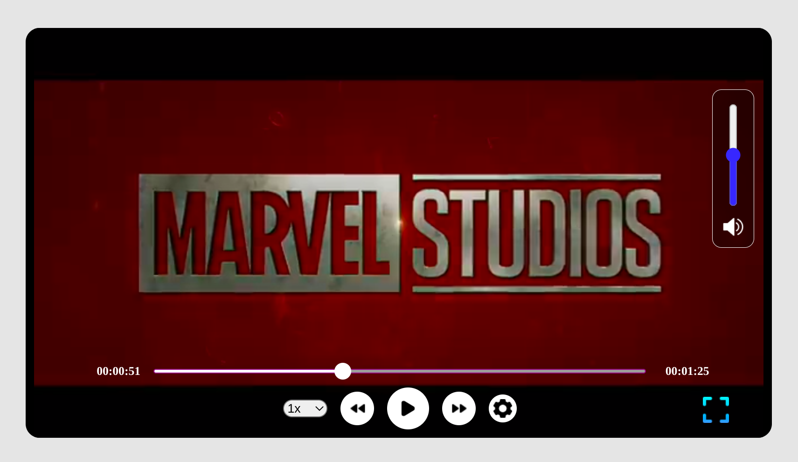

# Custom Video Player

## Table of contents

- [Overview](#overview)
  - [The challenge](#the-challenge)
  - [Screenshot](#screenshot)
  - [Links](#links)
- [My process](#my-process)
  - [Built with](#built-with)
- [Author](#author)

## Overview

### The challenge

Users should be able to:

- Choose the playback rate from the dropdown menu
- Play/Pause, Backward/Forward a video
- Change video quality and continue watching from the same point
- And also volume and fullscreen

### Screenshot

- Desktop version

### Links

- Solution URL: [GitHub](https://github.com/Giorgi-Jalali/custom-video-player)

- Live Site URL: [Vercel](https://custom-video-player-gjalali.vercel.app/)

## My process

### Built with

- [React](https://reactjs.org/) - JS library
- [Styled Components](https://styled-components.com/) - For styles
- [Redux/Toolkit](https://redux-toolkit.js.org/)

## Author

- LinkedIn - [Giorgi Jalali](https://www.linkedin.com/in/giorgi-jalali-0336b8225/)
